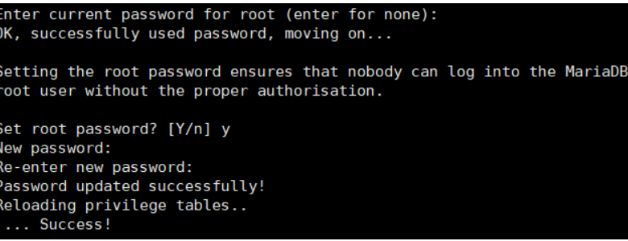
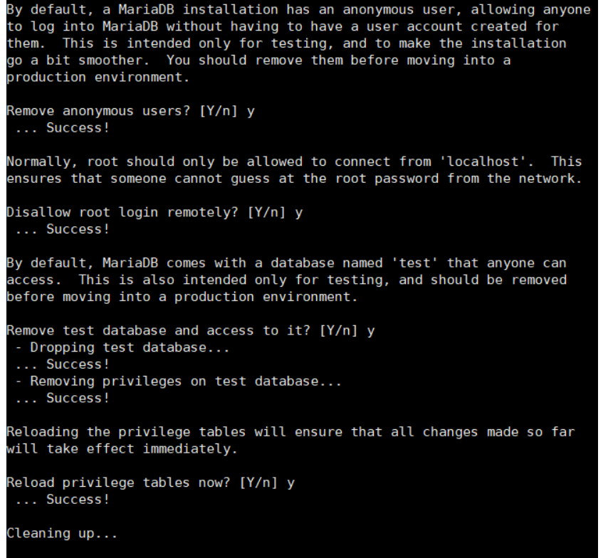
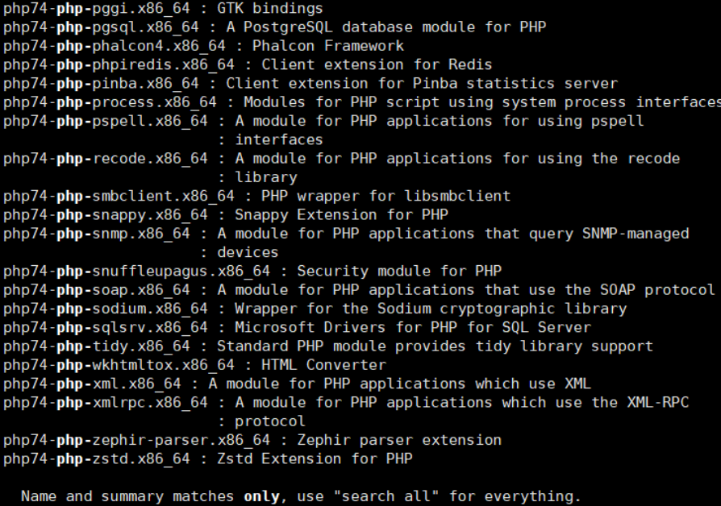

### 一、安装Apache Web服务器

#### 使用yum工具安装

```
sudo yum install httpd
```

#### 安装完成后，启动Apache Web服务器

```
sudo systemctl start httpd.service
```

##### 测试Apache服务器是否成功运行，使用浏览器输入自己腾讯云的公有IP地址(your_cvm_ip)

```
http://your_cvm_ip/
```

### 二、安装MySQL

#### 安装MariaDB:

```
sudo yum install mariadb-server mariadb

```


#### 安装好之后，启动mariadb:

```
sudo systemctl start mariadb
```

#### 运行简单的安全脚本以移除潜在的安全风险，启动交互脚本：

```
sudo mysql_secure_installation
```


#### 设置相应的root访问密码



#### 设置其相关的设置（都选择y）



#### 最后设置开机启动MariaDB:

```
sudo systemctl enable mariadb.service
```

### 三、安装PHP

#### 安装Remi仓库和EPEL仓库

```
sudo yum install epel-release yum-untils
sudo yum install http://rpms.remirepo.net/enterprise/remi-realease-7.rpm
```


#### 

```
sudo yum-config-manager --enable remi-php72
```

#### 安装PHP以及php-mysql

```
sudo yum install php php-mysql
```

#### 查看安装的php版本

```
php -v
```

#### 重启Apache服务器以支持PHP

```
sudo systemctl restart httpd.service
```

### 四、安装PHP模块

#### 查看可用模块

```
yum search php-
```

##### 

#### 安装php-fpm和php-gd

```
sudo yum install php-fpm php-gd
```

#### 重启Apache服务

```
sudo service httpd restart
```

### 五、测试PHP

#### 创建info.php并置于web服务器根目录

```
sudo vim /var/www/html/info.php
```

#### 在里面创建一个空白文件info.php,添加内容

```
<?php phpinfo(); ?>
```

#### 在本地主机浏览器查看

###  置

#### 为WordPress创建一个MySQL数据库

##### 以root用户登录MySQL数据库

```
mysql -u root -p
```

##### 创建一个新的数据库

```
CREATE DATABASE wordpress;
```

##### 创建一个独立的用户

```
CREATE USER wordpressuser@localhost IDENTIFIED BY ‘password’;
```

##### 设置数据库权限

```
GRANT ALL PRIVILEGES ON wordpress.* TO wordpressuser@localhost IDENTIFIED BY ‘password’;
```

刷新权限

```
FLUSH PRIVILEGES;
```

##### 退出命令行模式

```
exit
```

#### 安装WordPress

##### 下载WordPress

```
cd ~
wget http://wordpress.org/latest.tar.gz
```

##### 解压文件

```
tar xzvf latest.tar.gz
```

###### 解压后在主目录产生一个wordpress文件夹，并同步到Apache服务器的根目录下，使得wordpress的内容可以被访问。

```
sudo rsync -avP ~/wordpress/ /var/www/html/
```

##### 在wordpress下创建一个文件用来保存上传文件

```
mkdir /var/www/html/wp-content/uploads
```

##### 对Apache web服务器的目录以及wordpress相关文件夹设置访问权限

```
sudo chown -R apache:apache /var/www/html/*
```

#### 配置WordPress

##### 定位wordpress所在文件夹

```
cd /var/www/html
```

##### 拷贝wp-config-sample.php文件来生成wp-config.php文件

```
cp wp-config-sample.php wp-config.php
```

##### 使用nano超简单文本编辑器来修改MySQL相关配置

```
nano wp-config.php
```

###### 修改后使用 Ctrl+X，

###### 提示：save modified buffer ...? ，选择 ：yes

###### 又提示：file name to write ：***.launch ，选择：Ctrl+T

###### 在下一个界面用 “上下左右” 按键 选择要保存的文件名，

###### 然后直接点击 “Enter” 按键即可保存。

#### 通过web界面进一步配置WordPress

##### 设置网站标题，用户名和密码以及电子邮件等，点击Install WordPress,弹出确认页面

##### 点击登录，进行登录，进入WordPress的控制面板