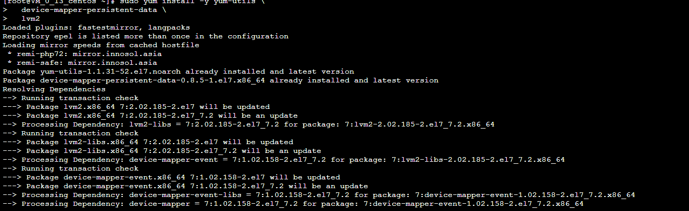

### Centos 7安装Docker

下载docker

查询docker版本

测试是否成功

### Docker加载CentOS镜像

**拉取 Centos 7**

**拉取完毕后查看镜像**

**运行Docker容器

查看已启动的容器

**进入容器前台**

容器里安装Apache Web

安装完成后，启动Apache Web服务器，设置开机自启

访问服务器公网IP,出现下图代表Apache安装成功

**安装MariaDB**

**启动MariaDB设置MySQL的root密码**

**设置开机自启MariaDB**

### 安装PHP

**因为WordPress需要php5.6以上版本的支持，我们更新到7.2版本仓库**

**安装PHP以及php-mysql**

**查看安装的php版本**

为了更好的运行PHP，需要启动PHP附加模块

### .安装WordPress以及完成相关配置

登陆数据库 给wordpress创建新的数据库

**进入刚创建的数据库**为WordPress创建一个独立的MySQL用户并授权给数据库访问权限****

**安装WordPress**

点击继续，填写先前创建的数据库名，用户名及密码

### 推送带有wordpress的镜像

上传至DOCKER HUB

