## 步骤1-配置所有节点

在此步骤中，我们将配置所有6个节点，以准备安装Ceph Cluster。您必须在所有节点上遵循并运行下面的所有命令。并确保在所有节点上都安装了ssh-server。


### 创建一个Ceph用户 添加用户配置权限**

在所有节点上创建一个名为“ **cephuser** ” 的新用户。**添加用户配置权限**

```
useradd -d /home/cephuser -m cephuser

passwd cephuser

echo "cephuser ALL = (root) NOPASSWD:ALL" | sudo tee /etc/sudoers.d/cephuser

chmod 0440 /etc/sudoers.d/cephuser

sed -i s'/Defaults requiretty/#Defaults requiretty'/g /etc/sudoers
```

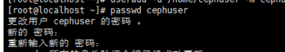

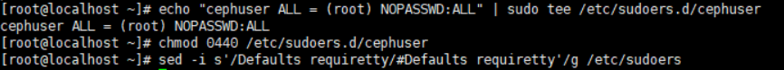

### 安装和配置NTP

安装NTP以同步所有节点上的日期和时间。运行ntpdate命令通过NTP协议设置日期和时间，我们将使用us pool NTP服务器。然后启动并启用NTP服务器在引导时运行。

```
yum install -y ntp ntpdate ntp-docntpdate 0.us.pool.ntp.orghwclock --systohcsystemctl enable ntpd.servicesystemctl start ntpd.service
```

 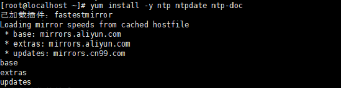

### 

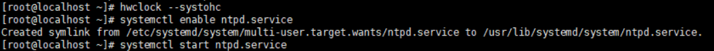

### 安装Open-vm-tools

如果要在VMware内部运行所有节点，则需要安装此虚拟化实用程序。否则，请跳过此步骤。

```
yum install -y open-vm-tools
```

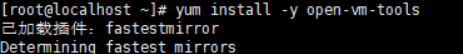

### 禁用SELinux

通过使用sed流编辑器编辑SELinux配置文件，在所有节点上禁用SELinux。

```
sed -i 's/SELINUX=enforcing/SELINUX=disabled/g' /etc/selinux/config
```

 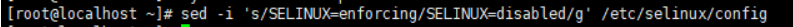

### 配置主机文件

使用vim编辑器在所有节点上编辑/ etc / hosts文件，并添加带有所有集群节点的IP地址和主机名的行。

```
vim /etc/hosts
```

粘贴以下配置：

```
10.0.15.10        ceph-admin
10.0.15.11          mon1
10.0.15.21          osd1
10.0.15.22         osd2
10.0.15.23        osd3
10.0.15.15         client
```

保存文件并退出vim。

现在，您可以尝试使用主机名在服务器之间ping通，以测试网络连接。例：

```
ping -c 5 mon1
```

## 第2步-配置SSH服务器

在此步骤中，我将配置**ceph-admin节点**。admin节点用于配置监视节点和osd节点。登录到**ceph** -admin节点并成为“ **cephuser** ”。

```
ssh root@ceph-admin
su - cephuser
```

admin节点用于安装和配置所有群集节点，因此ceph-admin节点上的用户必须具有无需密码即可连接到所有节点的特权。我们必须在“ ceph-admin”节点上为“ cephuser”配置无密码的SSH访问。

为“ **cephuser** ” 生成ssh密钥。

```
ssh-keygen
```

 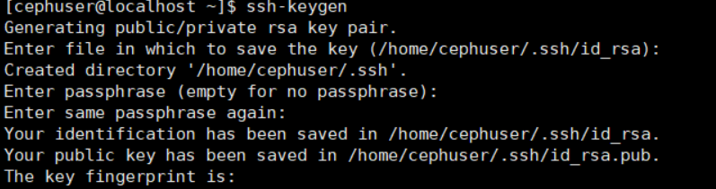

将密码短语留空/空白。

接下来，为ssh配置创建配置文件。

```
vim ~/.ssh/config
```

粘贴以下配置：

```
Host ceph-admin        Hostname ceph-admin        User cephuser Host mon1        Hostname mon1        User cephuser Host osd1        Hostname osd1        User cephuser Host osd2        Hostname osd2        User cephuser Host osd3        Hostname osd3        User cephuser Host client        Hostname client        User cephuser
```

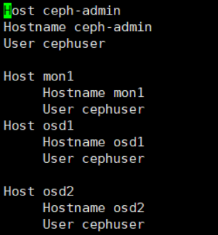

保存文件。

更改配置文件的权限。

```
chmod 644 ~/.ssh/config
```


现在，使用ssh-copy-id命令将SSH密钥添加到所有节点。

```
ssh-keyscan osd1 osd2  mon1 >> ~/.ssh/known_hosts
ssh-copy-id osd1
ssh-copy-id osd2
ssh-copy-id mon1
```

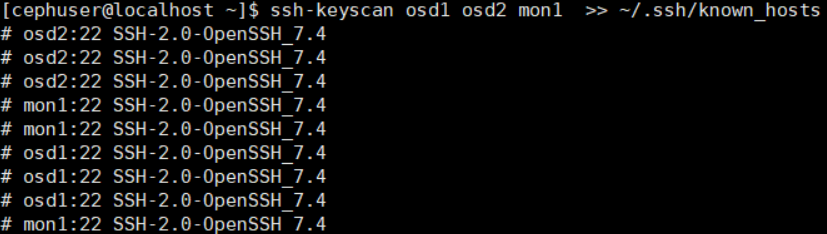

根据要求输入您的“ cephuser”密码。

## 步骤3-配置防火墙

我们将使用防火墙保护系统。在此步骤中，我们将在所有节点上启用firewald，然后打开ceph-admon，ceph-mon和ceph-osd所需的端口。

登录到ceph-admin节点并启动firewalld。

```
ssh root@ceph-admin
systemctl start firewalld
systemctl enable firewalld
```

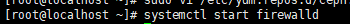


打开端口80、2003和4505-4506，然后重新加载防火墙。

```
sudo firewall-cmd --zone=public --add-port=80/tcp --permanent
sudo firewall-cmd --zone=public --add-port=2003/tcp --permanent
sudo firewall-cmd --zone=public --add-port=4505-4506/tcp --permanentsudo firewall-cmd --reload
```

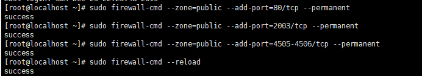

从ceph-admin节点登录到监视节点“ mon1”，然后启动firewalld。

```
ssh mon1
sudo systemctl start firewalld
sudo systemctl enable firewalld
```

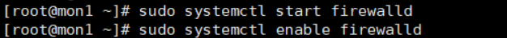

在Ceph监视节点上打开新端口，然后重新加载防火墙。

```
sudo firewall-cmd --zone=public --add-port=6789/tcp --permanent
sudo firewall-cmd --reload
```

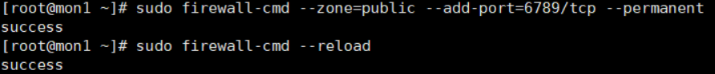

### ceph-deploy安装

**sudo yum update && sudo yum install ceph-deploy**

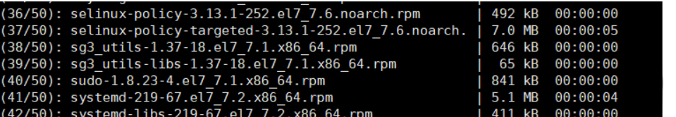

### **4.** **创建集群**

**mkdir cluster && cd cluster**

**ceph-deploy new mon1**

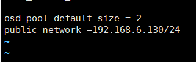

### 5. 在所有节点上安装Ceph

ceph-deploy install ceph-admin mon1 osd1 osd2

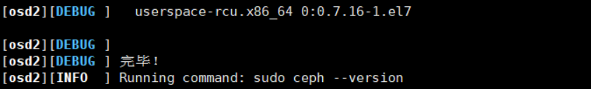

## 在mon1节点执行（改名）

```
hostnamectl set-hostname mon1
```


## **在主控节点**执行

```
ceph-deploy mon create-initial

ceph-deploy gatherkeys mon1
```

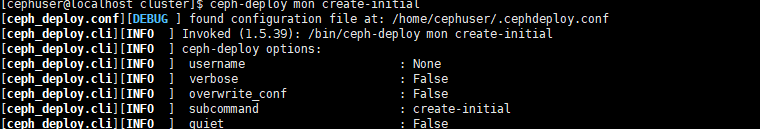

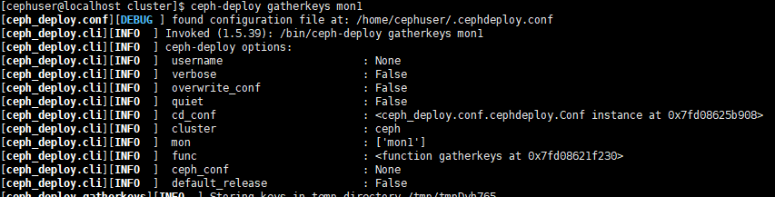

**为osd守护进程创建目录**

**osd节点**

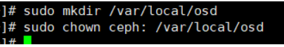

**主控节点**

**将管理密钥部署到所有关联的节点。**

**准备所有OSDS节点**

**ceph-deploy osd prepare osd1:/var/local/osd osd2:/var/local/osd**

**激活OSD**

**ceph-deploy osd activate osd1:/var/local/osd osd2:/var/local/osd密钥部署到所有关联的节点。**

**ceph-deploy admin ceph-admin mon1 osd1 osd2**

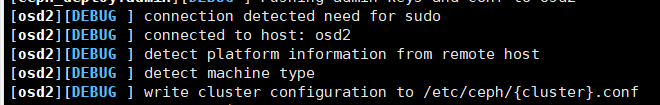

## 6.检查集群状态

**从ceph-admin节点登录到ceph监视服务器“ mon1 ”，运行以下命令以检查集群运行状况。**

ssh mon1

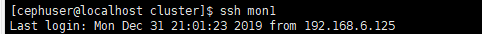

检查集群状态**

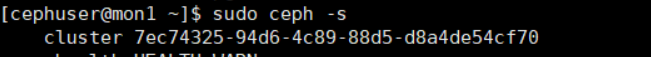

